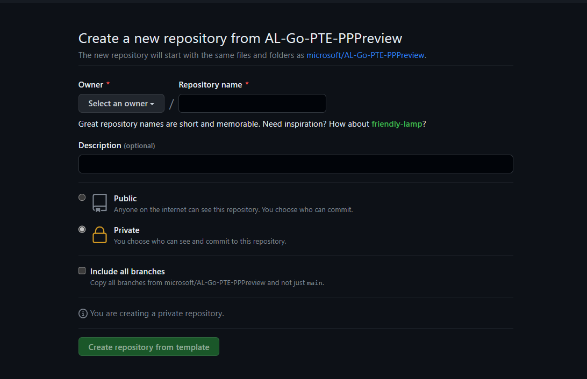
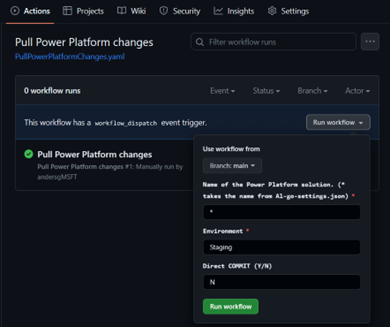

# (preview) Create a New Business Central and Power Platform Project

## Prerequisites
- Valid Business Central license
- Valid Power Platform license
- A GitHub Account
     
     

> **NOTE:** AL-Go App source does not currently support Power Platform solutions.

## Steps

1. Create a new repository based on the AL-Go-PTE template from [BusinessCentralDemos/AL-Go-PTE](https://github.com/BusinessCentralDemos/AL-Go-PTE)
   
   

   

2. Once the repository is set up, configure your Business Central and Power Platform authentication and deployment settings (See [Power Platform Repository setup](./SetupPowerPlatform.md) for detailed steps).  
   

3. If you already have a solution ready in your Power App repository, use the new "Pull Power Platform changes" action to have your solution and artifacts pulled into your repository. 

   
      

    If not, follow these steps:
   - Go to [make.powerapps.com](https://make.powerapps.com)
   - Create a new solution
   - Start building your Power Platform artifacts
   - Run the pull action when you are ready to pull the artifacts into your repository

  
   
4. Use the **Pull Power Platform Changes** action to get the latest changes from your Power Platform development environment and either check-in directly or create a PR to review them beforehand.

   > **NOTE:** Changes need to be published in Power Platform before they are included in the Pull action.
   
   > **NOTE:** A lot of the Power App source files contain state information and are safe to overwrite in case of conflicts. The connection files and the YAML files under Srs are the ones it makes sense to review.

  

5. After your changes are checked into a branch in the repository, you can use the **Push Power Platform changes** to deploy them to an environment. Or use the **CI/CD** flow or **Publish to Environment** action to deploy both the AL and Power Platoform solutions.
