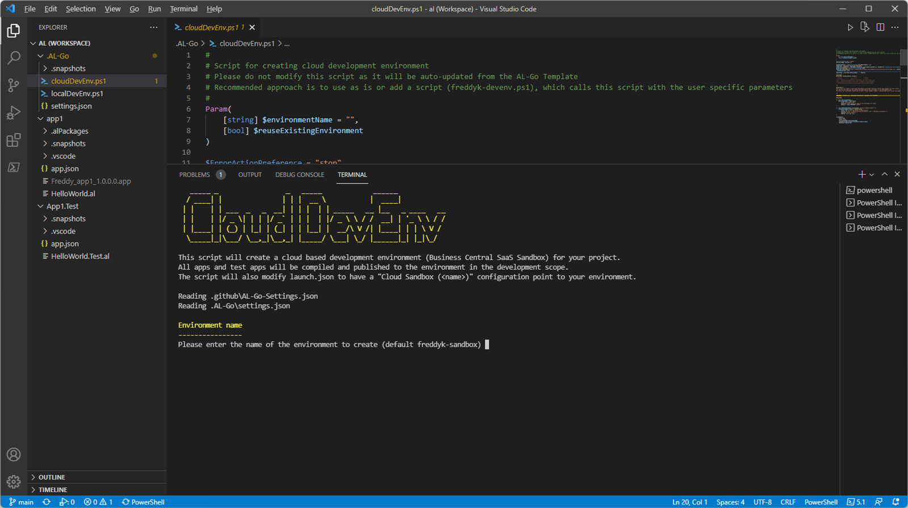
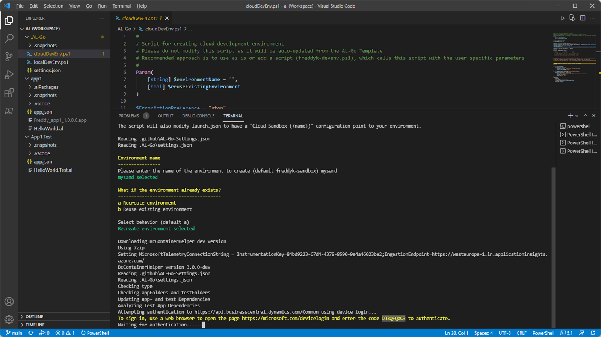
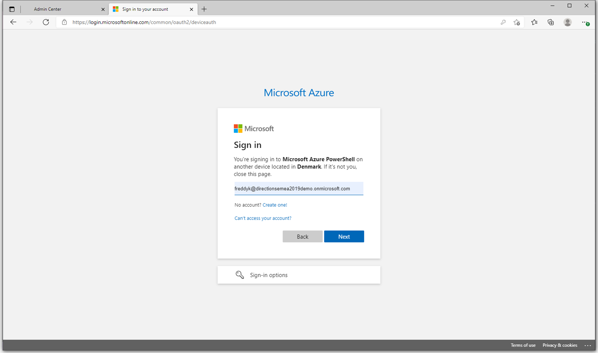
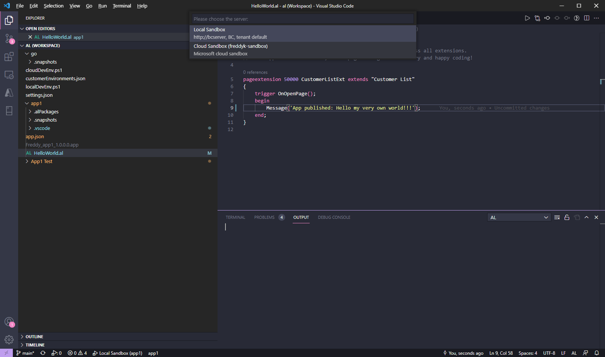

# #8 Create Online Development Environment from VS Code
*Prerequisites: A completed [scenario 7](UseAzureKeyVault.md)*

1. Open your **App1** project in VS Code, open the **cloudDevEnv.ps1** in your **.AL-Go** folder and run the script.

1. The script will ask for an **environment name** if it isn’t specified and it will ask whether you want to reuse or **recreate** the environment if it already exists. After this the script will need access to the **admin center API** and will initiate a **device code login** for this purpose.

1. Open [https://aka.ms/devicelogin](https://aka.ms/devicelogin) and paste in the **code provided**, sign in and accept that you are trying to sign in with PowerShell.

1. Wait for the script to finish. All apps are compiled and published to the online environment using the development scope and **VS Code is ready for RAD development**

1. Modify your app, press **F5** and select the **Cloud Sandbox** with your new name.

1. Your online environment will have your app changes.

1. The `launch.json` file will be updated with your new environment in VS Code. You can decide whether you want to check-in the changes to the repo or only use this locally.

---
[back](../README.md)
