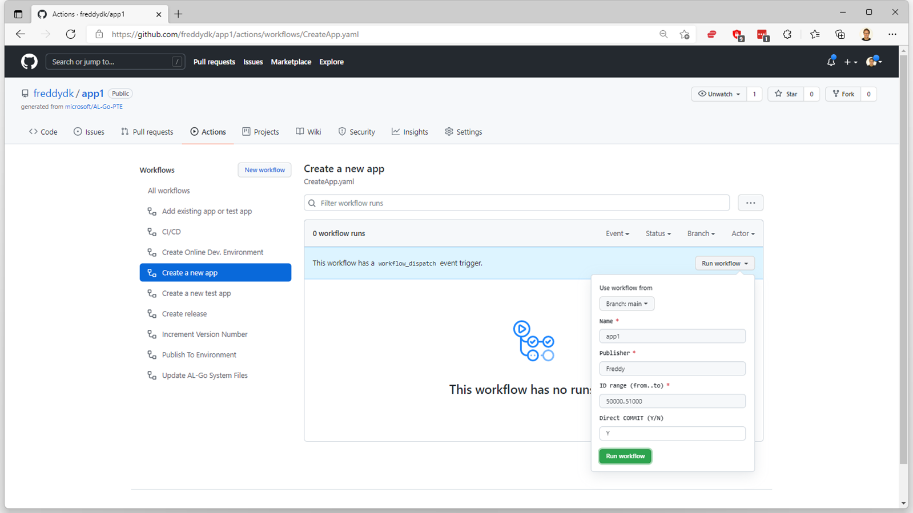

# #1 Create a new per-tenant extension (like AL Go) and start developing in VS Code
*Prerequisites: A GitHub account, VS-Code (with AL and PowerShell extensions installed), and Docker installed locally*

1. Navigate to https://github.com/microsoft/AL-Go-PTE and choose **Use this template**

1. Enter **app1** as repository name, select Public or Private and select **Create Repository from template**
1. Select **Actions** -> **Create a new app** -> **Run workflow**

1. Enter **Name**, **Publisher**, **ID range** and specify **Y** in **Direct COMMIT** and choose **Run workflow**.
1. When the workflow is complete, select **< > Code** in the top bar
1. Choose the **Code** button and copy the **https Clone Url** (in this picture: *https://github.com/freddydk/App1.git*)

1. Start **VS Code**, press **Ctrl+Shift+P** and select **Git Clone**, paste the clone URL and select a folder in which you want to clone the directory.
1. **Open the cloned repository** and **open the workspace** when VS Code asks you (or do it manually)
1. In the **.AL-Go** folder, choose the **localDevEnv.ps1** script and Run the PowerShell script.

1. Answer the questions asked about container name, authentication mechanism, credentials and select none for license file. The script might show a dialog asking for permissions to run docker commands, select **Yes** in this dialog. Wait for completion of the script.

1. In VS Code, press **Ctrl+Shift+P** and **clear the credentials cache**.
1. Open the **HelloWorld.al** file, modify the string and press **F5**. Depending on authentication selected VS Code might ask for the credentials you provided earlier.
1. Login to **Business Central** and your **very own world** opens up!

1. Back in **VS Code**, you will see that in addition to your changes in HelloWorld.al, the launch.json was also modified with the information about the local environment. **Stage your changes**, **commit** and **push**

1. Back on github.com, investigate your **Workflows**.

1. When the build is done, inspect the **Build summary** (no test app)

1. Inspect the workflow run by choosing the **build job**, expanding the **Run Pipeline** section and the **Compiling apps** subsection

---
[back](../README.md)
