# #B Migrate a repository from Azure DevOps to AL-Go for GitHub with history
*This walkthrough explains how to migrate a repository from Azure DevOps to AL-Go for GitHub **while preserving the full commit history**. As a sample, I will use a repository, which was setup using the CI/CD Hands On Lab, including scripts and pipelines from this.*

*If you do not want to preserve the full commit history, you should use [Scenario A](MigrateFromAzureDevOpsWithoutHistory.md) or [Scenario 11](SetupCiCdForExistingAppSourceApp.md)*

***Note: This walkthrough will leave your existing Azure DevOps repository untouched and you can decide to keep working in that if you like.***

1. Start out by navigating to your **Azure DevOps** repository. Click the **Clone** button and click **Generate Git Credentials**.
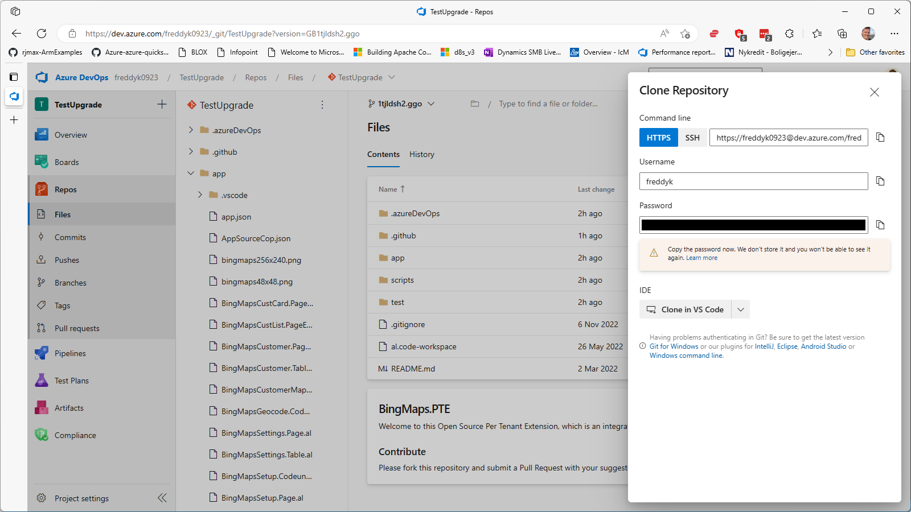
1. Copy the **Password** to the clipboard, navigate to **GitHub**, login and click the small **+** menu in the top right corner and select **Import repository**.
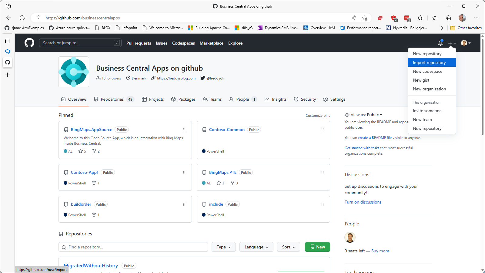
1. Enter the **GIT URL** to the Azure DevOps repository, choose the owner+name of the new GitHub repository and specify privacy level. Click **Begin Import**.
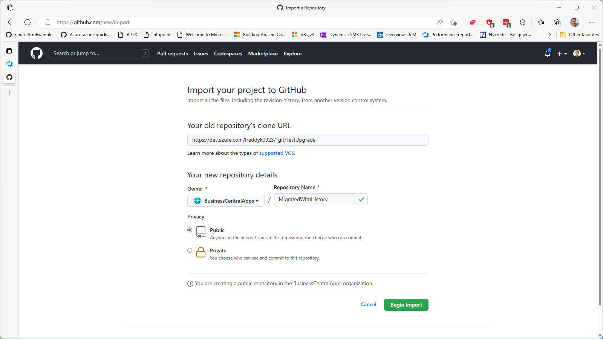
1. If your GIT repository requires **authentication**, you will be asked to provide this (the password you copied to the clipboard).
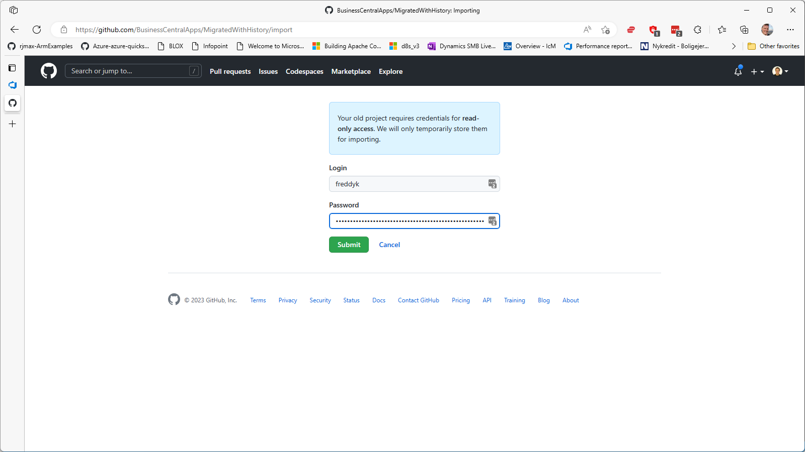
1. After GitHub is done importing your repo, you can **navigate to the repo**.
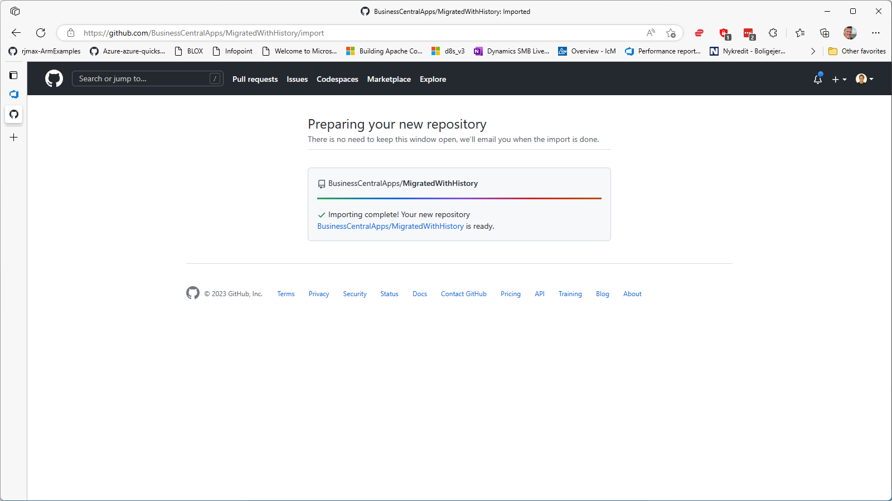
1. In the new GitHub repository, you might see different messages about branches and PRs. This is because GitHub has imported everything. Ignore this for now. Click the **<> Code** button and copy the git address to the clipboard.
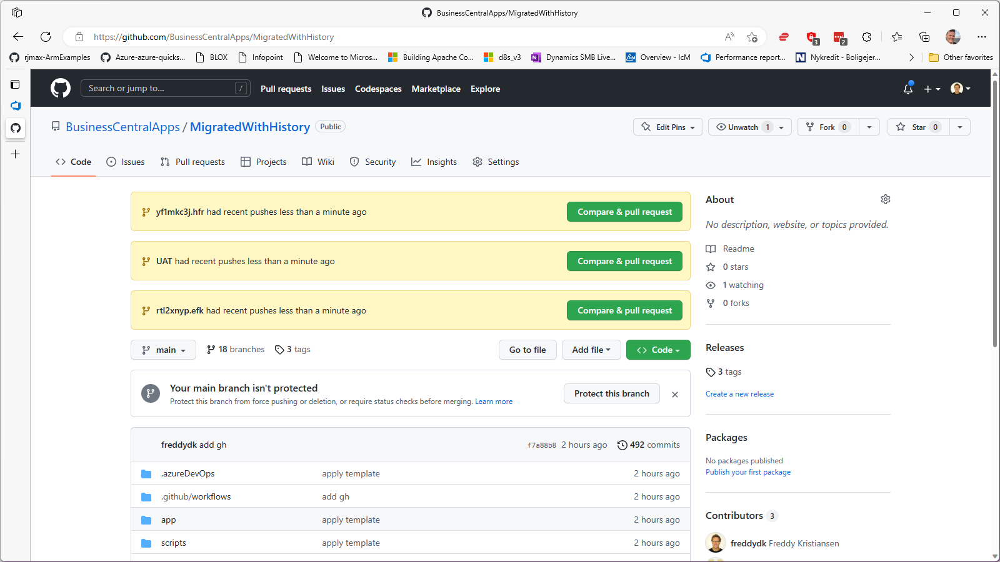
1. Open **VS Code**, press **Ctrl+Shift+P**, select **Git Clone** and paste your git URL into the address bar. Select a location, clone and open the repo and open the Repo in VS Code.
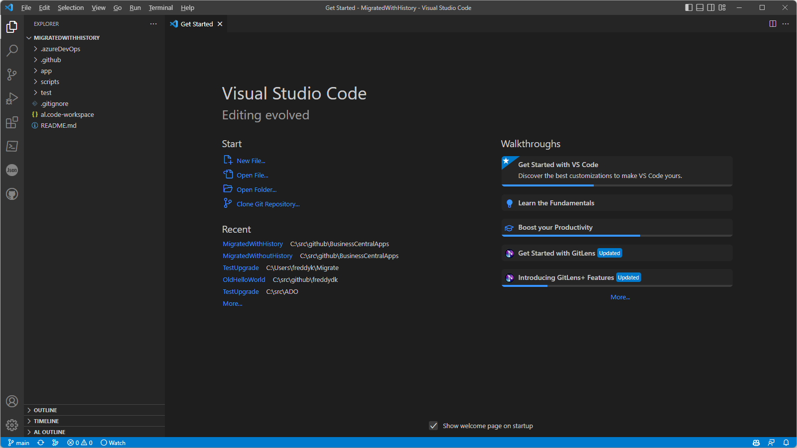
1. Delete the files and folders that are not needed in AL-Go for GitHub (including **.github**, **.azureDevOps**, **.pipelines** and **scripts** folders), leaving only your **apps**, your **test apps** and other files you want to preserve.
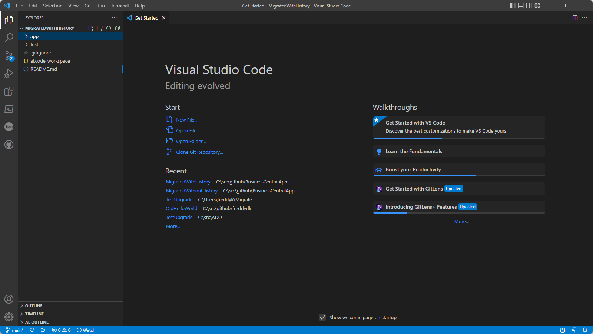
1. Now, download the AL-Go template needed, either the [PTE template](https://github.com/microsoft/AL-Go-PTE/archive/refs/heads/main.zip) or the [AppSource Template](https://github.com/microsoft/AL-Go-AppSource/archive/refs/heads/main.zip). Unpack the .zip file and open the unpacked template files.
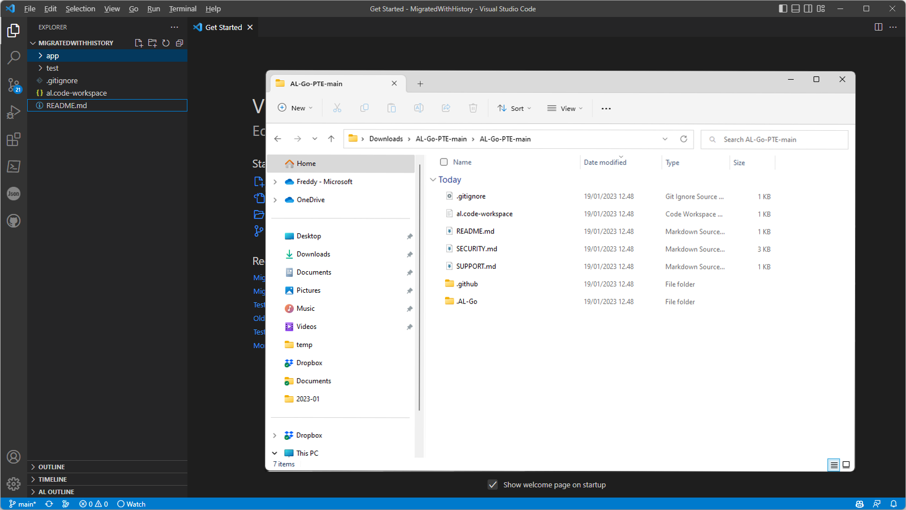
1. Drag the needed files and folders from the unpacked files file into VS Code (at a minimum the .AL-Go folder and the .github folder) and select to **Copy the folders**.
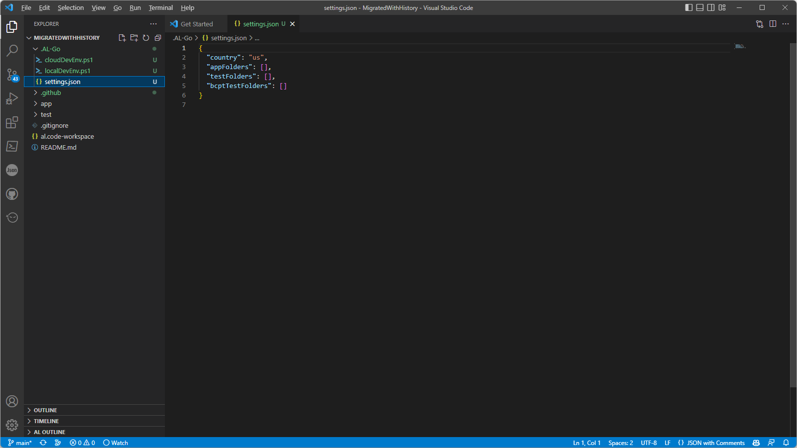
1. Modify any settings necessary for the app. Typical settings you might need to modify are:
    - appFolders, see https://aka.ms/algosettings#appfolders
    - testFolders, see https://aka.ms/algosettings#testfolders
    - appSourceMandatoryAffixes, see https://aka.ms/algosettings#appSourceMandatoryAffixes
    - enableAppSourceCop, see https://aka.ms/algosettings#enableAppSourceCop 
    - enablePerTenantExtensionCop, see https://aka.ms/algosettings#enablePerTenantExtensionCop
    - enableCodeCop, see https://aka.ms/algosettings#enableCodeCop
    - enableUICop, see https://aka.ms/algosettings#enableUICop
    - rulesetFile, see https://aka.ms/algosettings#rulesetFile
    - runNumberOffset, see https://aka.ms/algosettings#runNumberOffset

    Also, if you are migrating an AppSource App, you will need to create a secret called LicenseFileUrl, which should contain a secure direct download URL to your license file, as mentioned [here](SetupCiCdForExistingAppSourceApp.md).

    Finally, if you want AL-Go for GitHub to digitally sign your file, you need to create two secrets in the repository (or in the organization) called **CodeSignCertificateUrl** and **CodeSignCertificatePassword**, being a secure direct download URL to your PFX certificate and the PFX password for the certificate.

    See a list of all settings [here](settings.md).

1. In VS Code, in the Source Control area, **Add** all changed files, **Commit** the changes and press **Sync Changes** to push to GitHub.
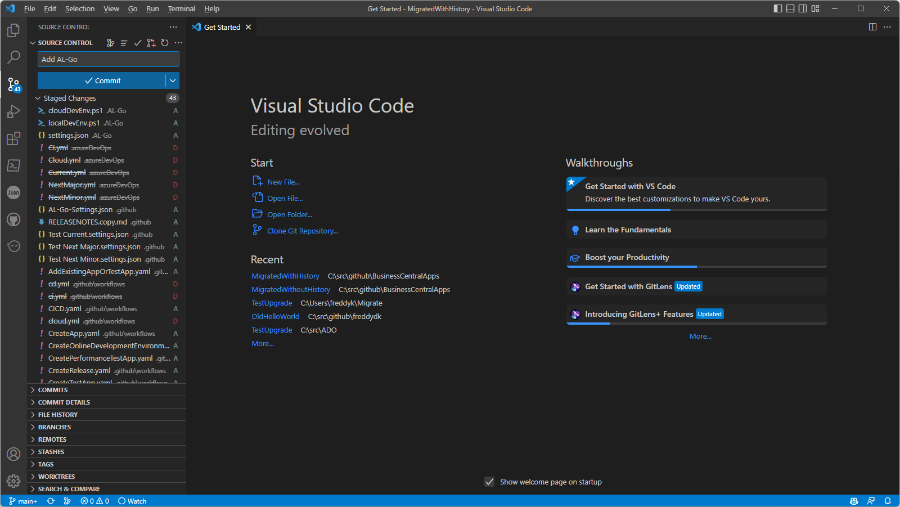
1. Navigate back to your repository on GitHub. See that your files have been uploaded. Click **Settings** -> **Actions** -> **General**, select **Allow all actions and reusable workflows** and click **Save**.
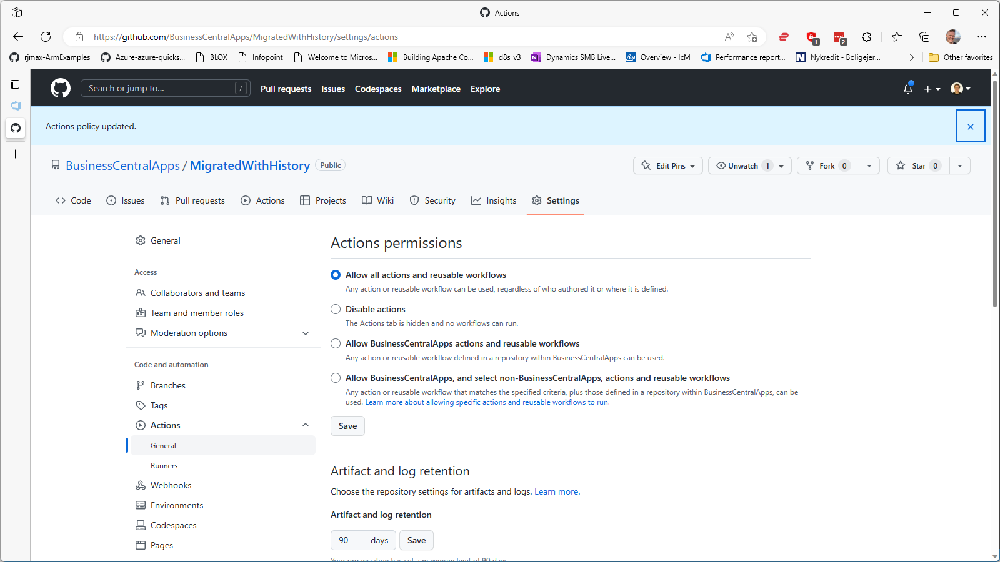
1. Click **Actions**, select the **CI/CD** workflow and click **Run workflow** to manually run the CI/CD workflow.
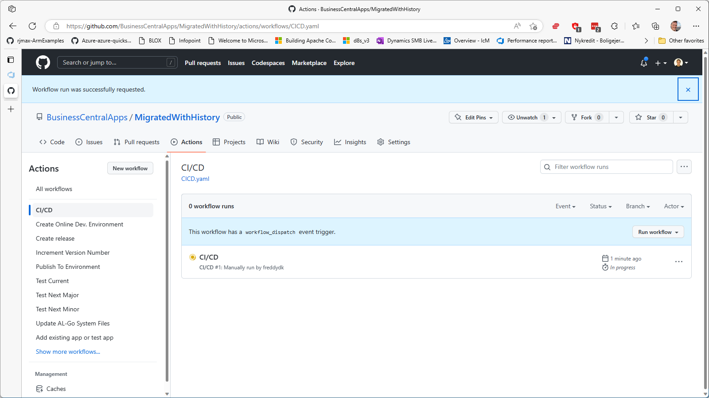
1. Open the running workflow to see **status and summary** and **wait for the build to complete**.

1. Scroll down to see the artifacts and the **test results**
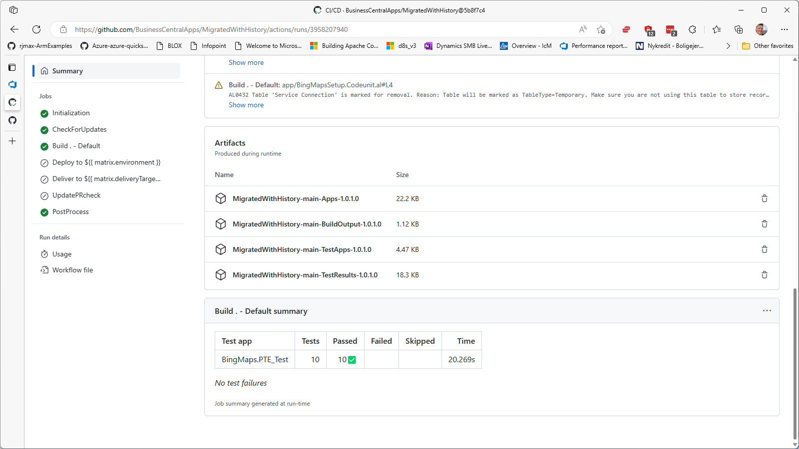
1. Navigate to **Code** and click **Commits** to see the history and all your commits.
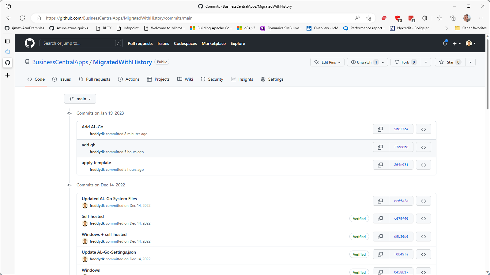

---
[back](../README.md)
