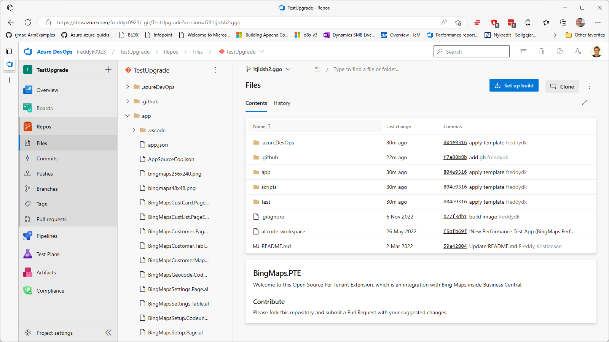
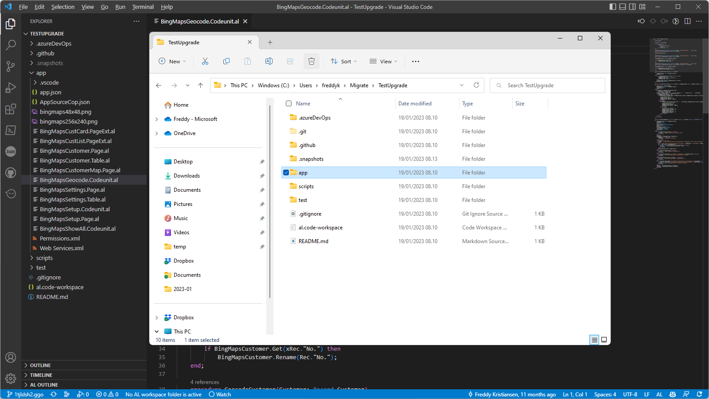
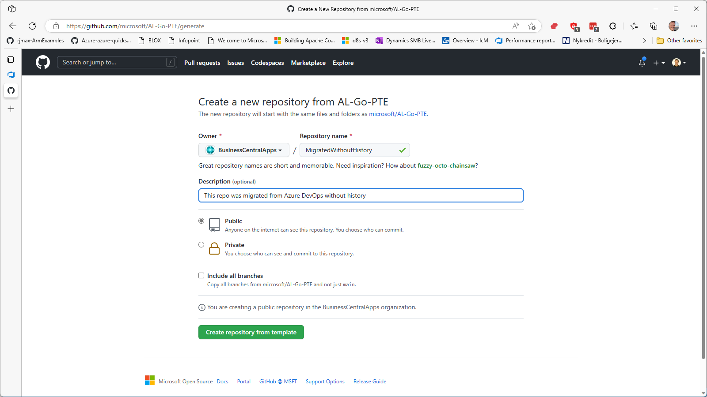
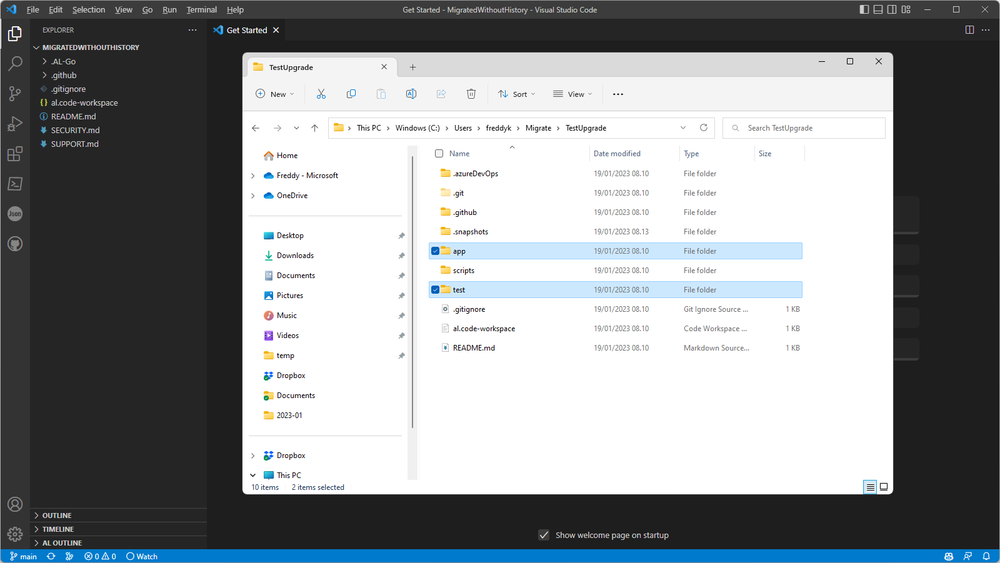
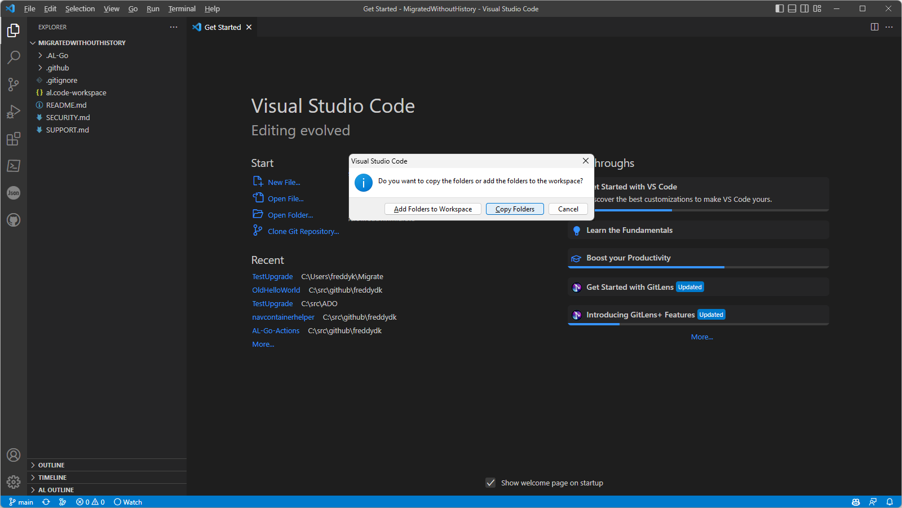
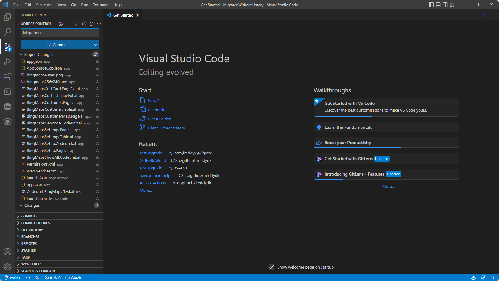
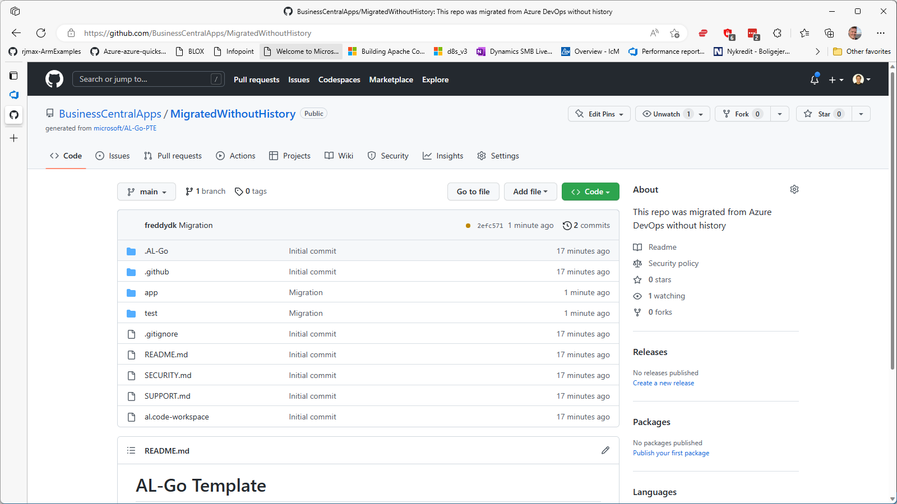
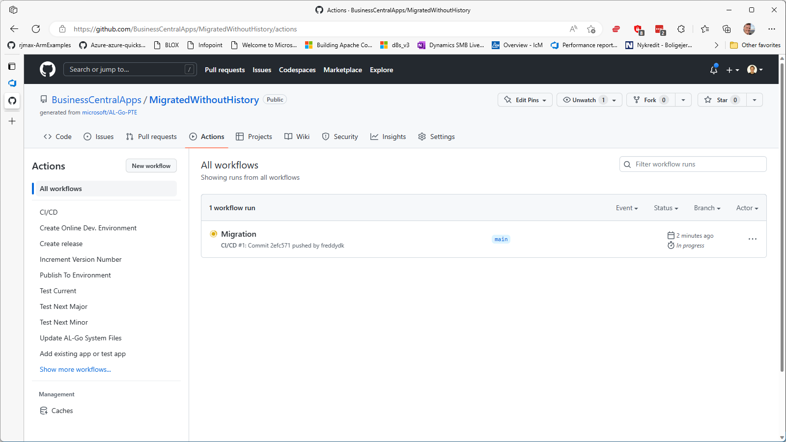
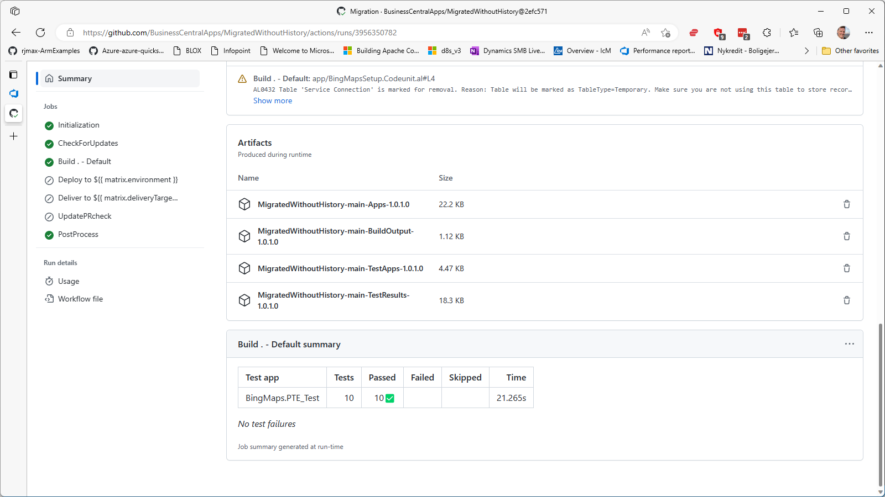
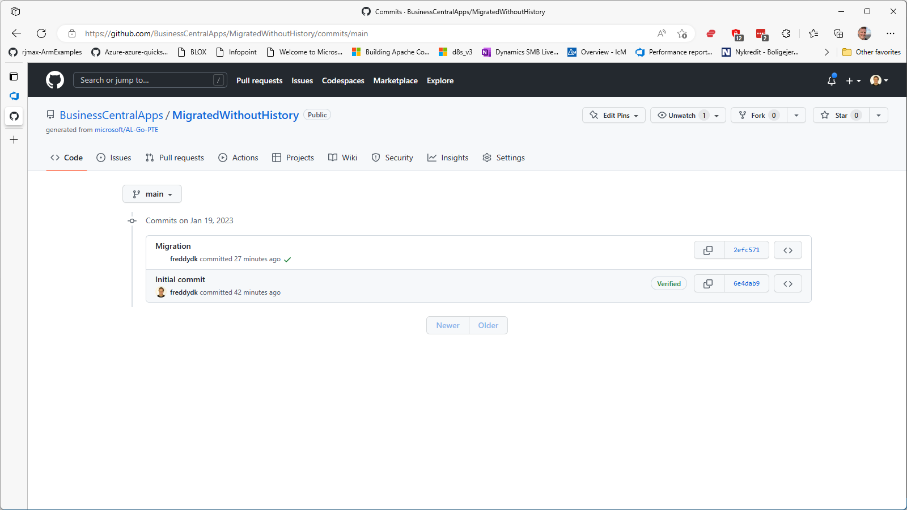

# #A Migrate a repository from Azure DevOps to AL-Go for GitHub without history
*This walkthrough explains how to migrate a repository from Azure DevOps to AL-Go for GitHub **without including the commit history**. As a sample, I will use a repository, which was setup using the CI/CD Hands On Lab, including scripts and pipelines from this.*

*This walkthrough is similar to [scenario 11](SetupCiCdForExistingAppSourceApp.md), but uses VS Code and File Explorer to move the files instead of uploading a .zip file.*

***Note: This walkthrough will leave your existing Azure DevOps repository untouched and you can decide to keep working in that if you like.***

1. Start out by navigating to your **Azure DevOps** repository. Click the **Clone** button.

1. Clone the repository to your PC by selecting Clone in **VS Code** (or your favorite way of cloning). And open the files in the **file explorer**.

1. Navigate to [https://aka.ms/algopte](https://aka.ms/algopte) or [https://aka.ms/algoappsource](https://aka.ms/algoappsource), click **Use this template**. Select **Create a new repository** and choose the owner + name of the repository and select public or private. Click **Create repository from template** and open the repository.

1. In the new repository, click the **<> Code** button and copy the git address to the clipboard. Open VS Code, press Ctrl+Shift+P, select **Git Clone** and paste your git URL into the address bar. Select a location, clone and open the repo and navigate to the File Explorer with the **Azure DevOps cloned files**.

1. In the file Explorer containing the cloned files from the Azure DevOps repo, select all the folders containing apps, test apps or other files you need to migrate over. Do not include the **.git**, **.github**, **.azureDevOps**, **.pipelines** and **scripts** folders - we won't be using them. Drag the files to VS Code and select **Copy Folders**

1. Modify any settings necessary for the app. Typical settings you might need to modify are:
    - appFolders, see https://aka.ms/algosettings#appfolders
    - testFolders, see https://aka.ms/algosettings#testfolders
    - appSourceMandatoryAffixes, see https://aka.ms/algosettings#appSourceMandatoryAffixes
    - enableAppSourceCop, see https://aka.ms/algosettings#enableAppSourceCop 
    - enablePerTenantExtensionCop, see https://aka.ms/algosettings#enablePerTenantExtensionCop
    - enableCodeCop, see https://aka.ms/algosettings#enableCodeCop
    - enableUICop, see https://aka.ms/algosettings#enableUICop
    - rulesetFile, see https://aka.ms/algosettings#rulesetFile
    - runNumberOffset, see https://aka.ms/algosettings#runNumberOffset

    Also, if you are migrating an AppSource App, you will need to create a secret called LicenseFileUrl, which should contain a secure direct download URL to your license file, as mentioned [here](SetupCiCdForExistingAppSourceApp.md).

    Finally, if you want AL-Go for GitHub to digitally sign your file, you need to create two secrets in the repository (or in the organization) called **CodeSignCertificateUrl** and **CodeSignCertificatePassword**, being a secure direct download URL to your PFX certificate and the PFX password for the certificate.

    See a list of all settings [here](settings.md).

1. In VS Code, in the Source Control area, **Add** all changed files, **Commit** the changes and press **Sync Changes** to push to GitHub.

1. Navigate back to your repository on GitHub. See that your files have been uploaded.

1. Click **Actions** to see that the **CI/CD** workflow was kicked off with your migration files.

1. Open the running workflow to see **status and summary** and wait for the build to complete.

1. Scroll down to see the **artifacts** and the **test results**.

1. Navigate to **Code** and click **Commits** to see the history.

---
[back](../README.md)
