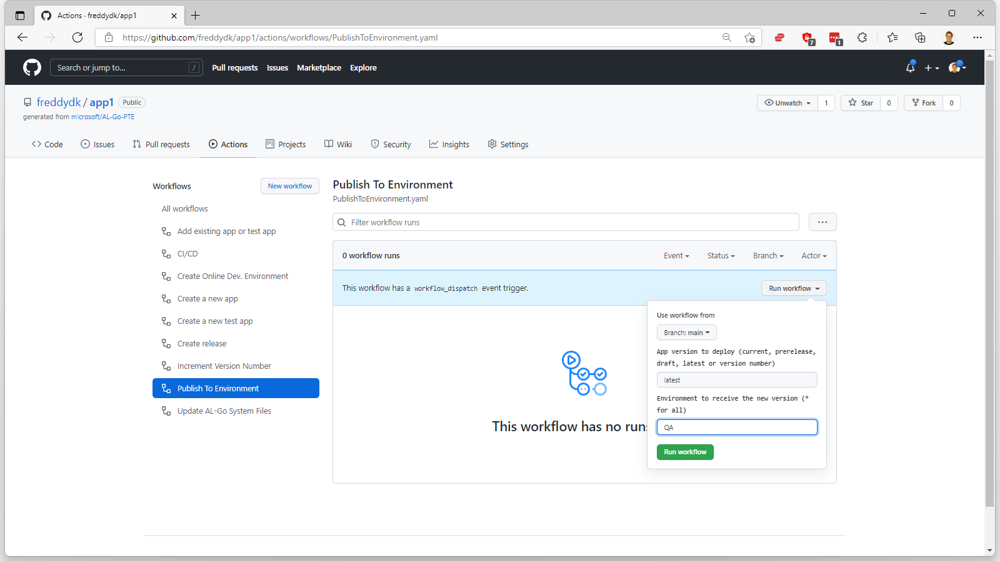
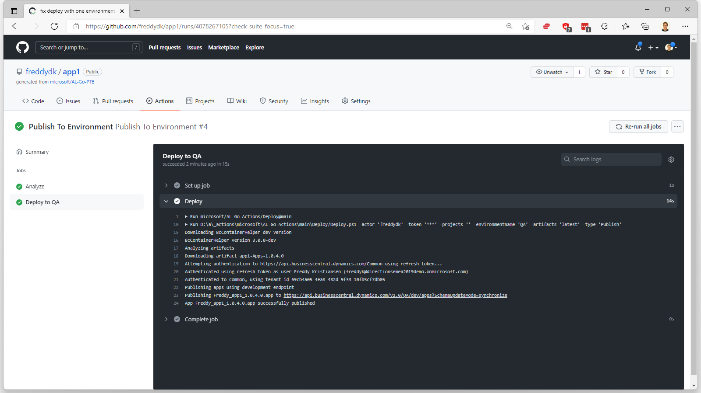

# #3 Register a customer sandbox environment for Continuous Deployment using S2S
*Prerequisites: A completed [scenario 2](AddATestApp.md), an AAD App, and an online sandbox environment called QA with the setup for S2S as specified in task 1 and 2 [here](https://go.microsoft.com/fwlink/?linkid=2217415&clcid=0x409) completed. You will also need the `BcContainerHelper PowerShell` module installed on your computer.*

***Note**: For access to environments, environment secrets, and deployment branches in private or internal repositories, you must use GitHub Pro, GitHub Team, or GitHub Enterprise. (see [this](https://go.microsoft.com/fwlink/?linkid=2216857&clcid=0x409)). We are considering adding a secondary option for listing environments.*
1. On github.com, open **Settings** and **Environments** in your project. Click **New Environment** and specify the **name of the environment** you have created in your tenant.

1. Under **Environment secrets**, choose the **Add Secret** action. Create a secret called **AUTHCONTEXT**, and enter a **COMPRESSED JSON** construct with 3 values: TenantID (where the environment lives), ClientID, and ClientSecret (from the pre-requisites), like:
`{"TenantID":"<TenantID>","ClientID":"<theClientID>","ClientSecret":"<theClientSecret>"}`

1. Navigate to **Actions**, select the **Publish To Environment** workflow and choose **Run workflow**. Enter **latest** in the **App version** field and the **name of your environment** or keep the * in the **environment to receive the new version** field. Click **Run workflow**.

1. When the workflow completes, you can inspect the output of the workflow.

1. And/or you can open the QA environment, navigate to Customers and see that your very own Hello World message appears.

---
[back](../README.md)
