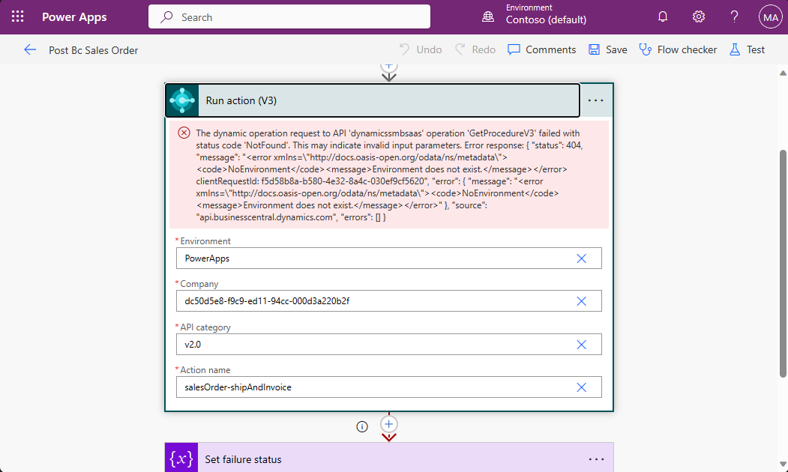
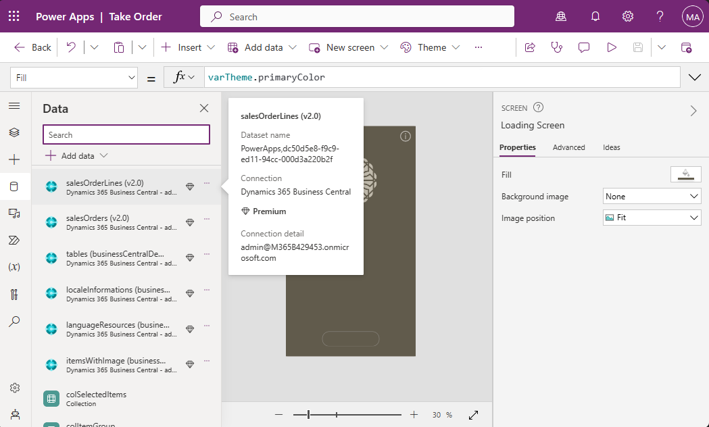

# [PREVIEW] Try one of the Business Central and Power Platform samples

The easiest way to get started with Business Central and Power Apps is to find one of our sample apps:

- [Take Order](https://github.com/microsoft/bcsamples-takeorder)
- [Warehouse helper](https://github.com/microsoft/bcsamples-warehousehelper) 

> **NOTE:** Other samples might be available here:  [https://github.com/topics/bcsamples](https://github.com/topics/bcsamples).

From the sample app repositories, you have two options:

- [Manual installation](#manual-installation) 
- [Fork the repository](#fork-the-repository)

## Manual Installation
If you just want to try the apps and not the ALM functionality, follow these steps:

1. In the App repository, find the latest release and download the Power platform solution and the Business Central extension zip files. *Note:* You need to unzip the files to access the actual extension and solution file.

2. Upload the Business Central extension to your Business Central environment.

3. (Optional) Open the sample page to generate demo data.

4. Import the Power Platform solution to your Power Platform environment. You will be asked to add a Business Central connection if your environment does not have one. Follow the steps in the wizard to add it.
    > **Note:** You might receive a warning about the imported flow. This is expected and will be addressed in a subsequent step.

5. Update the flow so it is pointing to your Business Central environment and company. Clear the current values and use the dropdown to select your settings.

6. Update the Power App data sources to point to your Business Central environment. When you hover over the data source, the connection information is displayed under the 'Dataset name'. 

    Delete the existing connections. Then, add new ones that point to your environment and company. You can do this by using the '+ Add data' button.
    

    > **Note:** After the data sources have been updated and you verified that the app is working, use the 'Publish' action in the upper right corner to make the changes available when running the app outside the editor.

If you experience any issues while setting up the app, please log them in the 'Issues' tab of the sample repository - [Take order issues](https://github.com/microsoft/bcsamples-takeorder/issues), [Warehouse Helper issues](https://github.com/microsoft/bcsamples-warehousehelper/issues) - or post the issue in the [Business Central partner community](https://www.yammer.com/dynamicsnavdev/#/threads/inGroup?type=in_group&feedId=64329121792) for assistance. 

## Fork the Repository

This gives you access to all the source code for the Power Platform solution and AL extension and the ALM infrastructure. Follow the steps in the  [Power Platform repository setup guide](./SetupPowerPlatform.md) to get started. Once set up, you can easily publish the latest changes to your environment.

> **NOTE:** The first time you import the solution into your environment, you need to set up the Business Central connection reference authentication. See an example in the screen shot below

Choose the method that suits you best and get started with exploring the capabilities of Business Central and Power Platform!

---
[back](../README.md)
