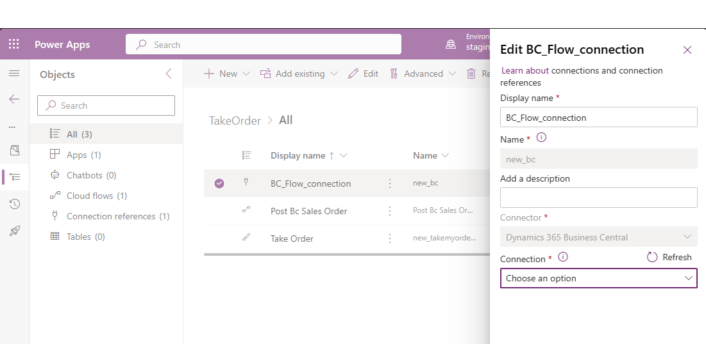
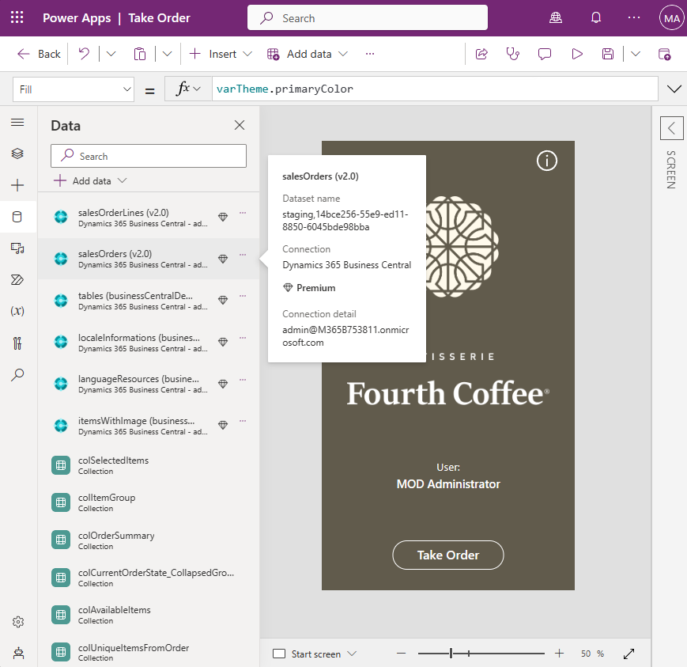

# [PREVIEW] Try one of the Business Central and Power Platform samples

The easiest way to get started with Business Central and Power Apps is to find one of our sample apps:

- [Take Order](https://github.com/microsoft/businesscentralsamples-takeorder)
- [Warehouse helper](https://github.com/microsoft/businesscentralsamples-warehousehelper) 

> **NOTE:** Other samples might be available here: [https://github.com/topics/businesscentralsamples](https://github.com/topics/businesscentralsamples).

From the sample app repository, you have two options:

## Fork the Repository

This gives you access to all the source code for the Power Platform solution and AL extension. Follow the steps in the  [Power Platform repository setup guide](./SetupPowerPlatform.md) to get started. Once set up, you can easily publish the latest changes to your environment.¨

> **NOTE:** : The first time you import the solution into your environment, you need to set up the Business Central connection reference authentication. See an example in the screen shot below

## Manual Deployment

Alternatively, you can manually deploy the AL extension and Power Platform solution package. You can find the files under the repository release artifacts.

> **NOTE:** If you choose this method, you have to manually update the Business Central data references within the Power App and Power Automate flow components. See an example in the screen shot below
    

Choose the method that suits you best and get started with exploring the capabilities of Business Central and Power Platform!

---
[back](../README.md)
