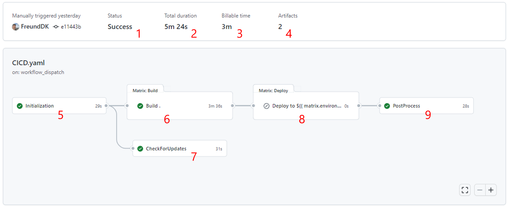

# Create your first AL-Go repository

## Excercise
Watch a video of the excercise [here](https://youtu.be/rWc81EG_sMk)

## Steps
- In a browser, navigate to https://aka.ms/algopte
  - Select **your organization** as owner and use **app1** as repository name
  - Choose **private**
- In the new repository
  - Under **Actions**, select **Create a new app** and click **Run workflow**
    - Specify values for **name**, **publisher**, **ID range** and click **Run Workflow**
  - After the **workflow completes**, you will have a new **pull request**
    - Inspect and **merge the PR** and see that it kicks off a **CI/CD** workflow

## Inspect the build
You can navigate to the build workflow and after the build completes, the status should like like:

Where the numbers refer to:
1. Success/Failure indicator
2. Total duration of the workflow
3. Minutes spend on GitHub hosted runners
4. No. of artifacts generated
5. Initialize job
6. Check for Updates job
7. Build job
8. Deployment/Delivery job
9. Finalize job

---
[index](index.md)&nbsp;&nbsp;[previous](GitHubSettings.md)&nbsp;&nbsp;[next](.md)
